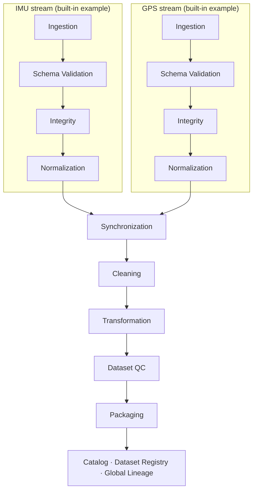

# Forge Data

**Reproducible data infrastructure for robotics and Physical AI.**

**v1.0** · English · [中文](README.zh-CN.md) · [Full Technical Guide](docs/DETAILED_GUIDE.md)


<!-- No banner asset is committed to this repository yet. -->

Forge Data turns raw, heterogeneous sensor streams into validated, synchronized,
quality-controlled, leakage-safe, lineage-tracked datasets for machine learning. It is built
for robotics and Physical AI workflows, where independently-clocked streams like IMU and GPS
have to move through deterministic, auditable preprocessing before they're trainable — and
where you need to be able to answer "where did this exact dataset come from?" months later.

## Forge Data v1.0

v1.0 is the first complete release of the local core pipeline — a single, coherent chain
from raw upload to a versioned, lineage-tracked dataset:

```
Ingestion → Validation → Integrity → Normalization → Synchronization
   → Cleaning → Transformation → Dataset QC → Packaging
   → Global Lineage & Dataset Registry
```

Every stage in that chain is implemented, tested, and wired together end to end — see
[Status](#status) for what that guarantees today and what's intentionally out of scope.

## Why Forge Data?

Robotics and multimodal sensor data has a set of problems that generic ML data tooling
doesn't address well:

- **Heterogeneous formats and inconsistent units** — one file in `g`, another in `m/s²`, a third with no unit recorded at all.
- **Independent clocks** — IMU and GPS streams drift relative to each other and need explicit temporal alignment, not a naive join.
- **Missing modalities and quality issues** — a sensor drops out mid-session; a bad batch shouldn't silently poison a dataset.
- **Overlapping windows and leakage** — feature-extraction windows that share source rows must never land on both sides of a train/test split.
- **Reproducibility and lineage** — "which raw files, which config, which code version produced this exact package?" needs a real answer, not a guess.

Forge Data's approach:

- **Immutable artifacts** — every stage writes once; a changed input produces a new artifact, never an in-place edit.
- **SHA-256 lineage everywhere** — every artifact and manifest is checksummed, and every stage records its upstream parent explicitly.
- **Deterministic transformations** — normalization, windowing, and splitting are configuration- and seed-driven, not incidental.
- **Explicit stage boundaries** — validation, integrity, normalization, synchronization, cleaning, and QC are separate, independently testable services.
- **Leakage-safe dataset packaging** — samples are grouped by source overlap *before* any split decision is made.
- **A reconstructible metadata catalog** — a SQLite index over the pipeline's own manifests, never a second source of truth.

## Pipeline overview



IMU and GPS are the schemas and normalization profiles shipped with the repository today;
the ingestion → validation → integrity → normalization chain, synchronization's multi-stream
alignment, and the catalog's lineage graph are all schema-agnostic and designed to take
additional sensor types without changes to earlier stages.

## Core capabilities

| Stage | Responsibility | Key guarantees / output |
|---|---|---|
| **Ingestion** | Immutable raw upload | Streamed SHA-256 hashing, write-once storage, manifest per upload |
| **Schema Validation** | Per-record schema conformance | Structured error/warning reports; built-in IMU and GPS schemas |
| **Integrity** | Semantic/range/consistency checks | Deeper than schema shape — extreme values, ordering, per-schema checkers |
| **Normalization** | Canonical units and UTC timestamps | Deterministic derived artifact; pluggable per-schema profiles |
| **Synchronization** | Temporal alignment across streams | Nearest / linear-interpolation alignment, configurable tolerance, explicit clock correction |
| **Cleaning** | Filtering and redaction | Deterministic drop/redact policies, coverage and duplicate rules |
| **Transformation** | Feature extraction | Deterministic count/time windowing, handcrafted statistical + derived features |
| **Dataset QC** | Dataset-level quality control | Modality coverage, feature completeness, variance, and drift checks |
| **Packaging** | Train/validation/test generation | Group-aware, leakage-safe deterministic splitting; JSONL (+ optional Parquet) export |
| **Catalog** | Global lineage and dataset registry | SQLite index, rebuildable from filesystem manifests; dataset registry with immutable SemVer versions |

## Data flow example

```
Input:            imu.csv, gps.csv

Pipeline:         upload → validate → integrity → normalize → synchronize
                   → clean → transform → QC → package

Output:           train.jsonl
                   validation.jsonl
                   test.jsonl
                   split_index.jsonl
                   manifest.json          (per stage, at every step)
                   + lineage recorded in the catalog, traceable back to imu.csv / gps.csv
```

The full curl-by-curl walkthrough lives in the [Full Technical Guide](docs/DETAILED_GUIDE.md#end-to-end-demo).

## Design guarantees

**Immutable artifacts** — stages never rewrite upstream outputs. A raw upload, a validation
report, a normalized artifact, a package — once written, none of them are ever edited or
overwritten by a later stage.

**Deterministic execution** — normalization, windowing, and dataset splitting are driven by
explicit configuration and seeds, not incidental runtime state. Two independent runs over the
same bytes and configuration produce the same derived artifacts and the same reproducibility
fingerprint.

**Explicit lineage** — every artifact carries the ID and SHA-256 of its upstream parent(s).
The catalog turns this into an explicit parent → child DAG rather than an implied ordering.

**Separation of concerns** — schema validation, integrity checking, normalization,
synchronization, cleaning, and QC are deliberately separate services with their own storage
roots and their own test suites, not phases of one monolithic job.

**Leakage-safe packaging** — Step 7's overlapping feature windows are grouped by source-row
overlap *before* Step 9 makes any train/validation/test split decision, so no split can ever
divide a group of overlapping samples across partitions.

**Rebuildable catalog** — the SQLite catalog is an index, not a source of truth. It can be
deleted and fully reconstructed from the filesystem manifests any stage already writes.

## Quick start

```bash
git clone https://github.com/uudam42/forge-data.git
cd forge-data
python3 -m venv .venv && source .venv/bin/activate
pip install -e ".[dev]"

uvicorn app.main:app --reload
pytest
```

Interactive API docs (Swagger UI) are served at **http://localhost:8000/docs** — every
endpoint can be explored and called from the browser without writing a single curl command.

Minimal example — upload a raw file:

```bash
curl -X POST http://localhost:8000/api/v1/ingestion/upload \
  -F "file=@imu.csv" -F "customer_id=demo" -F "device_id=imu_001"
# -> { "ingestion_id": "ing_...", "status": "stored", "sha256": "...", ... }
```

The full 10-stage curl walkthrough is in the [Full Technical Guide](docs/DETAILED_GUIDE.md).

### Product quick start (CLI + local GUI)

The 10-stage API above is what the pipeline runs on; you don't have to
call it by hand. v2.7 adds a `forge` CLI and a local browser GUI on top
of it — install (or `pip install -e .` from this checkout), then:

```bash
forge init demo && cd demo
forge run pipelines/example.yaml     # or: forge serve, then open http://127.0.0.1:8000
```

`forge serve` starts the API and a local GUI (Dashboard, New Run, Run
Detail, a Results Explorer, Datasets, Lineage) at `http://127.0.0.1:8000` —
local-process execution with durable run metadata, not a distributed job
queue. From there you can start a pipeline run, watch it progress, cancel
it if needed, and inspect the final package, QC report, and lineage
without touching the filesystem or Swagger UI directly. Full CLI command
reference: [docs/CLI.md](docs/CLI.md); architecture:
[docs/DETAILED_GUIDE.md#local-cli-and-gui-v27](docs/DETAILED_GUIDE.md#local-cli-and-gui-v27).

## API surface

| Group | Prefix | Purpose |
|---|---|---|
| Ingestion | `/api/v1/ingestion` | Raw upload, immutable storage |
| Validation | `/api/v1/validation` | Per-record schema validation |
| Integrity | `/api/v1/integrity` | Semantic/range/consistency checks |
| Normalization | `/api/v1/normalization` | Canonical units and timestamps |
| Synchronization | `/api/v1/synchronization` | Multi-stream temporal alignment |
| Cleaning | `/api/v1/cleaning` | Filtering, deduplication, redaction |
| Transformation | `/api/v1/transformation` | Windowing and feature extraction |
| QC | `/api/v1/qc` | Dataset-level quality control |
| Packaging | `/api/v1/packaging` | Train/validation/test packaging and export |
| Catalog | `/api/v1/catalog` | Scan, rebuild, health, artifact lookup, verification |
| Lineage | `/api/v1/lineage` | Upstream/downstream traversal, impact analysis |
| Datasets | `/api/v1/datasets` | Dataset registry, versions, reproducibility |

Full endpoint reference, request/response shapes, and error codes: [Full Technical Guide](docs/DETAILED_GUIDE.md).

## Output structure

```
data/
  raw/            Immutable original uploads + manifests
  validation/     Schema validation reports
  integrity/      Integrity check reports
  normalized/     Canonical-unit artifacts
  synchronized/   Time-aligned multi-stream artifacts
  cleaned/        Filtered/redacted artifacts
  transformed/    Windowed feature artifacts
  qc/             Dataset QC reports
  packages/       Versioned train/validation/test packages
  catalog/        SQLite metadata catalog (catalog.db)
```

Runtime contents of every directory above are excluded from version control except a
`.gitkeep` placeholder — `data/` is regenerated by running the pipeline, never committed.

## Dataset versioning and lineage

A dataset version is an immutable pointer to exactly one package, with the full upstream
chain reconstructible from the catalog:

```
robotics_demo @ 1.0.0
      └─ package
            ├─ transformation
            │     └─ cleaning
            │           └─ synchronization
            │                 ├─ IMU normalization
            │                 └─ GPS normalization
            │                       └─ raw ingestions
            └─ QC report
```

- Registering a version against a *different* package than the one it already points to is
  rejected outright (`409 DATASET_VERSION_IMMUTABLE`) — a version is a permanent pointer.
- `POST /api/v1/catalog/verify/{type}/{id}?recursive=true` recomputes checksums for an
  artifact and its entire upstream lineage in one call.
- `GET /api/v1/datasets/{name}/versions/{version}/reproducibility` returns every content
  and config hash behind a package plus a single **lineage fingerprint** — a SHA-256 over
  that hash set, excluding execution IDs and timestamps, so two independent runs over
  equivalent data and configuration produce the identical fingerprint.
- `GET /api/v1/lineage/{type}/{id}/impact` reports downstream impact — what breaks, and
  which dataset versions are affected, if a given upstream artifact turns out to be bad.

## Testing

1139 tests currently cover per-stage behavior, lineage gates, determinism, artifact
immutability, checksum validation, API contracts, crash-safety/atomic-commit
guarantees (including real subprocess kill tests), sensor plugin contracts (IMU, GPS,
Force/Torque), pipeline runs/cancellation, and the `forge` CLI, plus full end-to-end
pipeline runs.

```bash
pytest
```

An additional opt-in `tests/load/` suite (15 tests, deselected by default) exercises real
memory measurement at up to 1,000,000-row scale, an opt-in `tests/concurrency/` suite
(26 tests) exercises real multiprocess contention, and a separate frontend suite
(21 tests, Vitest) covers the GUI:

```bash
pytest -m load
pytest -m concurrency
cd frontend && npm test
```

## Project structure

```
app/
  ingestion/ validation/ integrity/ normalization/   Per-stage services
  synchronization/ cleaning/ transformation/
  qc/ packaging/
  sensors/            Sensor plugin architecture — imu/, gps/, force_torque/, registry
  catalog/            Lineage graph, verification, dataset registry, SQLite catalog
  storage/            Immutable artifact stores (one per stage) + catalog store
  api/routes/         FastAPI routers, one per stage
  runs/               PipelineRun/StageRun execution model, progress, cancellation (v2.6)
  cli/                `forge` CLI commands (v2.7)
  web/                Built frontend, bundled as package data (v2.7)
frontend/             React/TypeScript/Vite GUI source (v2.7)
tests/                1139 tests (+ opt-in tests/load/, 15, and tests/concurrency/, 26)
app/resources/schemas/   Built-in IMU / GPS / Force-Torque schema definitions (bundled package resource)
docs/DETAILED_GUIDE.md   Full architecture, API, and error-code reference
docs/ADDING_SENSOR.md   Step-by-step guide to adding a new sensor plugin
```

## Status

**Current release: Forge Data v1.0**

The v1.0 core pipeline is complete and validated end-to-end, with:

- immutable per-stage artifacts
- deterministic transformations
- dataset-level QC
- leakage-safe packaging
- global lineage
- a dataset version registry

v2 development:
- v2.1 Crash Safety & Atomic Artifacts — COMPLETE
- v2.2 Large-scale Streaming & Resource Bounds — COMPLETE
- v2.3 Sensor / Schema Plugin System — COMPLETE
- v2.4 Multiprocess Concurrency & SQLite Safety — COMPLETE
- v2.5 Data Governance & Selective Rebuild — COMPLETE
- v2.6 Pipeline Runs, Progress, Cancellation & Observability — COMPLETE
- v2.7 Local CLI, GUI, Results Explorer & Distribution — COMPLETE

**v2.1 (Crash Safety & Atomic Artifacts)** adds a cross-cutting reliability guarantee on top
of v1.0: every derived artifact is staged and published atomically, so a crashed or killed
process can never leave a partial artifact where a finalized one is expected. Details:
[Full Technical Guide § Crash consistency and atomic artifacts](docs/DETAILED_GUIDE.md#crash-consistency-and-atomic-artifacts-v21).

**v2.2 (Large-scale Streaming & Resource Bounds)** documents a resource contract for every
stage, adds a scalable SQLite-backed exact-dedup option for cleaning (the default in-memory
backend's O(unique_rows) growth is now measured and documented, not just claimed), and adds
disk-space preflight checks before large writes. Details:
[Full Technical Guide § Large-data execution and resource model](docs/DETAILED_GUIDE.md#large-data-execution-and-resource-model-v22).

**v2.3 (Sensor / Schema Plugin System)** turns IMU, GPS, and a new built-in 6-axis
Force/Torque sensor into a coherent `SensorPlugin` architecture — adding a sensor is one
plugin package and one registration line, with zero changes to synchronization, cleaning,
QC, packaging, or catalog code (verified by an automated source-text check). See
[docs/ADDING_SENSOR.md](docs/ADDING_SENSOR.md) for the practical guide, or
[Full Technical Guide § Sensor plugin architecture](docs/DETAILED_GUIDE.md#sensor-plugin-architecture-v23) for the design.

**v2.4 (Multiprocess Concurrency & SQLite Safety)** makes the catalog safe when several
local processes on the same machine — multiple `uvicorn` workers, concurrent pipeline
requests, independent scripts — share one workspace and one `catalog.db`: verified WAL
journaling, a bounded busy timeout with a structured error, race-safe (database-constraint-
authoritative) artifact/dataset/version registration, and an OS-level exclusive rebuild lock.
This is single-machine, multiprocess-safe local catalog access — not a distributed or
cross-machine database. Details:
[Full Technical Guide § Multiprocess concurrency model](docs/DETAILED_GUIDE.md#multiprocess-concurrency-model-v24).

**v2.5 (Data Governance & Selective Rebuild)** turns lineage from passive observability into
active governance: mark an artifact or dataset version deprecated/invalid (append-only
history, no manifest ever touched), a downstream-processing gate blocks new work through an
invalid artifact or ancestor, enriched impact analysis shows each affected dataset version's
computed status, and a selective-rebuild planner/executor produces a new, corrected lineage
branch — reusing every unaffected sibling parent unchanged — while the old branch and old
dataset version stay fully intact and inspectable. This is governance-aware lineage and
descendant rebuild planning, not automatic repair or a job orchestrator. Details:
[Full Technical Guide § Data governance and selective rebuild](docs/DETAILED_GUIDE.md#data-governance-and-selective-rebuild-v25).

**v2.6 (Pipeline Runs, Progress, Cancellation & Observability)** adds a first-class,
durable `PipelineRun`/`StageRun` execution model: submit a multi-stream (IMU/GPS/Force-Torque)
pipeline as one run, poll its status/progress/produced artifacts, request cooperative
cancellation, and see a v2.5 selective rebuild's own observable run record. Progress and
structured execution status are honest and throttled — never a fabricated percentage — and a
process crash is reconciled to a clean failed state at the next startup, never an automatic
resume. This is local-process execution with durable run metadata, not a distributed job
queue. Details:
[Full Technical Guide § Pipeline runs and observability](docs/DETAILED_GUIDE.md#pipeline-runs-and-observability-v26).

**v2.7 (Local CLI, GUI, Results Explorer & Distribution)** turns the platform into an
installable product: a `forge` CLI, a local browser GUI served by the existing FastAPI
app, a Results Explorer that resolves a completed run's package/QC/splits/lineage
without ever reading split-file contents, and a wheel whose schemas and built frontend
are bundled inside the package so they work identically from a source checkout and an
installed wheel run from anywhere. This is local-process execution with durable run
metadata, not a distributed job queue. Details:
[Full Technical Guide § Local CLI and GUI](docs/DETAILED_GUIDE.md#local-cli-and-gui-v27) ·
[CLI command reference](docs/CLI.md).

The current implementation is **local-first and single-node** — designed for large
single-machine workloads, not distributed/cloud scale. Cloud storage, orchestration,
authentication, multi-tenancy, and a web dashboard are planned for the next phase — see
[Roadmap](#roadmap).

## Current scope

**Implemented:**
- Local filesystem–backed pipeline, end to end (ingestion through packaging and catalog)
- IMU, GPS, and Force/Torque as built-in sensor plugins (schema, integrity, normalization,
  features) — see [docs/ADDING_SENSOR.md](docs/ADDING_SENSOR.md) to add another
- FastAPI HTTP API with interactive Swagger docs
- Deterministic processing, dataset QC, and leakage-safe packaging
- SQLite-backed metadata catalog, rebuildable from filesystem manifests

**Deliberately not implemented yet:**
- Cloud object storage backends (S3 / GCS / Azure Blob)
- Authentication, authorization, or multi-tenancy
- Distributed or orchestrated (multi-machine) execution
- Automatic sensor schema inference
- A production-grade (non-SQLite) database deployment

## Roadmap

Realistic next steps, not commitments or dates:

- Pluggable cloud storage backends
- Authentication and workspace isolation
- Richer robotics connectors (e.g. ROS bag ingestion)
- Production observability (metrics, structured tracing)

## Documentation

- [Full Technical Guide](docs/DETAILED_GUIDE.md) — architecture, every API and error code, per-stage design notes, MVP limitations
- [CLI reference](docs/CLI.md) — every `forge` command
- [Adding a Sensor](docs/ADDING_SENSOR.md) — step-by-step guide to adding a new sensor plugin
- [中文文档](README.zh-CN.md)

## Contributing

This project doesn't yet have a formal contribution process — if you're interested in
contributing, open an issue to discuss what you have in mind before sending a pull request.
