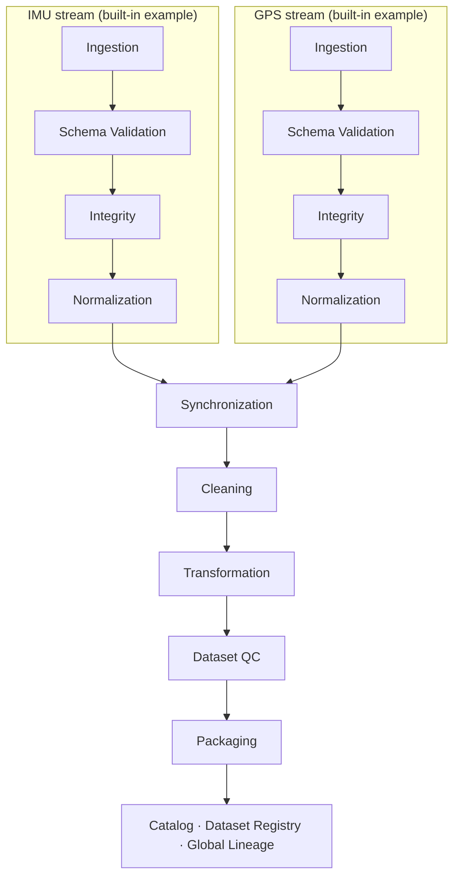

# Forge Data

**Reproducible data infrastructure for robotics and Physical AI.**

**v2.0** · English · [中文](README.zh-CN.md) · [Full Technical Guide](docs/DETAILED_GUIDE.md)


<!-- No banner asset is committed to this repository yet. -->

Forge Data turns raw, heterogeneous sensor streams into validated, synchronized,
quality-controlled, leakage-safe, lineage-tracked datasets for machine learning. It is built
for robotics and Physical AI workflows, where independently-clocked streams like IMU and GPS
have to move through deterministic, auditable preprocessing before they're trainable — and
where you need to be able to answer "where did this exact dataset come from?" months later.

## Forge Data v2.0

Forge Data is a local-first pipeline platform that takes raw sensor uploads all the way to a
versioned, ML-ready dataset package:

```
Ingestion → Validation → Integrity → Normalization → Synchronization
   → Cleaning → Transformation → Dataset QC → Packaging
   → Global Lineage & Dataset Registry
```

Every stage in that chain is crash-safe, deterministic, and lineage-tracked, and the whole
pipeline is reachable from an installable CLI and local GUI — no source checkout required.
On top of the core pipeline, v2.0 adds: crash-safe atomic artifacts and recovery, large-data
resource bounds (validated to 1M+ rows), a composable sensor plugin architecture (IMU, GPS,
Force/Torque built in), a multiprocess-safe catalog, governance-aware lineage with selective
rebuild, durable pipeline runs with progress and cancellation, and a `forge` CLI + local GUI
with a Results Explorer. See [CHANGELOG.md](CHANGELOG.md) for the full history and
[docs/RELEASE_NOTES_V2.md](docs/RELEASE_NOTES_V2.md) for the complete feature tour, usage,
and known limitations. Upgrading from v1.0? See
[docs/MIGRATION_V1_TO_V2.md](docs/MIGRATION_V1_TO_V2.md).

## Why Forge Data?

Robotics and multimodal sensor data has a set of problems that generic ML data tooling
doesn't address well:

- **Heterogeneous formats and inconsistent units** — one file in `g`, another in `m/s²`, a third with no unit recorded at all.
- **Independent clocks** — IMU and GPS streams drift relative to each other and need explicit temporal alignment, not a naive join.
- **Missing modalities and quality issues** — a sensor drops out mid-session; a bad batch shouldn't silently poison a dataset.
- **Overlapping windows and leakage** — feature-extraction windows that share source rows must never land on both sides of a train/test split.
- **Reproducibility and lineage** — "which raw files, which config, which code version produced this exact package?" needs a real answer, not a guess.

Forge Data's approach:

- **Immutable artifacts** — every stage writes once; a changed input produces a new artifact, never an in-place edit.
- **SHA-256 lineage everywhere** — every artifact and manifest is checksummed, and every stage records its upstream parent explicitly.
- **Deterministic transformations** — normalization, windowing, and splitting are configuration- and seed-driven, not incidental.
- **Explicit stage boundaries** — validation, integrity, normalization, synchronization, cleaning, and QC are separate, independently testable services.
- **Leakage-safe dataset packaging** — samples are grouped by source overlap *before* any split decision is made.
- **A reconstructible metadata catalog** — a SQLite index over the pipeline's own manifests, never a second source of truth.

## Pipeline overview



IMU and GPS are the schemas and normalization profiles shipped with the repository today;
the ingestion → validation → integrity → normalization chain, synchronization's multi-stream
alignment, and the catalog's lineage graph are all schema-agnostic and designed to take
additional sensor types without changes to earlier stages.

## Core capabilities

| Stage | Responsibility | Key guarantees / output |
|---|---|---|
| **Ingestion** | Immutable raw upload | Streamed SHA-256 hashing, write-once storage, manifest per upload |
| **Schema Validation** | Per-record schema conformance | Structured error/warning reports; built-in IMU and GPS schemas |
| **Integrity** | Semantic/range/consistency checks | Deeper than schema shape — extreme values, ordering, per-schema checkers |
| **Normalization** | Canonical units and UTC timestamps | Deterministic derived artifact; pluggable per-schema profiles |
| **Synchronization** | Temporal alignment across streams | Nearest / linear-interpolation alignment, configurable tolerance, explicit clock correction |
| **Cleaning** | Filtering and redaction | Deterministic drop/redact policies, coverage and duplicate rules |
| **Transformation** | Feature extraction | Deterministic count/time windowing, handcrafted statistical + derived features |
| **Dataset QC** | Dataset-level quality control | Modality coverage, feature completeness, variance, and drift checks |
| **Packaging** | Train/validation/test generation | Group-aware, leakage-safe deterministic splitting; JSONL (+ optional Parquet) export |
| **Catalog** | Global lineage and dataset registry | SQLite index, rebuildable from filesystem manifests; dataset registry with immutable SemVer versions |

## Data flow example

```
Input:            imu.csv, gps.csv

Pipeline:         upload → validate → integrity → normalize → synchronize
                   → clean → transform → QC → package

Output:           train.jsonl
                   validation.jsonl
                   test.jsonl
                   split_index.jsonl
                   manifest.json          (per stage, at every step)
                   + lineage recorded in the catalog, traceable back to imu.csv / gps.csv
```

The full curl-by-curl walkthrough lives in the [Full Technical Guide](docs/DETAILED_GUIDE.md#end-to-end-demo).

## Design guarantees

**Immutable artifacts** — stages never rewrite upstream outputs. A raw upload, a validation
report, a normalized artifact, a package — once written, none of them are ever edited or
overwritten by a later stage.

**Deterministic execution** — normalization, windowing, and dataset splitting are driven by
explicit configuration and seeds, not incidental runtime state. Two independent runs over the
same bytes and configuration produce the same derived artifacts and the same reproducibility
fingerprint.

**Explicit lineage** — every artifact carries the ID and SHA-256 of its upstream parent(s).
The catalog turns this into an explicit parent → child DAG rather than an implied ordering.

**Separation of concerns** — schema validation, integrity checking, normalization,
synchronization, cleaning, and QC are deliberately separate services with their own storage
roots and their own test suites, not phases of one monolithic job.

**Leakage-safe packaging** — Step 7's overlapping feature windows are grouped by source-row
overlap *before* Step 9 makes any train/validation/test split decision, so no split can ever
divide a group of overlapping samples across partitions.

**Rebuildable catalog** — the SQLite catalog is an index, not a source of truth. It can be
deleted and fully reconstructed from the filesystem manifests any stage already writes.

## Quick start

Forge Data is not yet published to PyPI — install it from a built wheel or directly from
source (see [Running from source](#running-from-source) below). Once installed, the workflow
is the same either way. Initialize a workspace and run the built-in example pipeline
(IMU + GPS):

```bash
forge init demo && cd demo
forge run pipelines/example.yaml
```

That produces a versioned, ML-ready package: leakage-safe train/validation/test splits
(JSONL), a dataset QC report, and a full lineage trail back to the original raw uploads —
all registered in the local catalog and inspectable with `forge datasets`, `forge lineage`,
and `forge verify`.

Prefer a GUI? `forge serve` starts the same pipeline behind a local browser UI at
`http://127.0.0.1:8000`:

```bash
forge serve
```

From there you can submit a run, watch live progress, cancel it if needed, and open the
Results Explorer to inspect the final package, QC report, dataset registration, and lineage
— all backed by the same local API the CLI uses. Full CLI reference: [docs/CLI.md](docs/CLI.md).

### Running from source

```bash
git clone https://github.com/uudam42/forge-data.git
cd forge-data
python3 -m venv .venv && source .venv/bin/activate
pip install -e ".[dev]"
pytest

forge init demo && cd demo && forge run pipelines/example.yaml
```

Or build and install a wheel (this also builds the frontend and bundles it into the
package, so the GUI works from the installed wheel with no separate `npm` step):

```bash
cd frontend && npm ci && npm run build && cd ..
python -m build
pip install dist/forge_data-*.whl
```

The underlying HTTP API (used by both the CLI and GUI) also has interactive Swagger docs at
**http://127.0.0.1:8000/docs** when `forge serve` is running — every endpoint can be explored
and called from the browser directly. The full curl-by-curl API walkthrough is in the
[Full Technical Guide](docs/DETAILED_GUIDE.md#end-to-end-demo).

## API surface

| Group | Prefix | Purpose |
|---|---|---|
| Ingestion | `/api/v1/ingestion` | Raw upload, immutable storage |
| Validation | `/api/v1/validation` | Per-record schema validation |
| Integrity | `/api/v1/integrity` | Semantic/range/consistency checks |
| Normalization | `/api/v1/normalization` | Canonical units and timestamps |
| Synchronization | `/api/v1/synchronization` | Multi-stream temporal alignment |
| Cleaning | `/api/v1/cleaning` | Filtering, deduplication, redaction |
| Transformation | `/api/v1/transformation` | Windowing and feature extraction |
| QC | `/api/v1/qc` | Dataset-level quality control |
| Packaging | `/api/v1/packaging` | Train/validation/test packaging and export |
| Catalog | `/api/v1/catalog` | Scan, rebuild, health, artifact lookup, verification |
| Lineage | `/api/v1/lineage` | Upstream/downstream traversal, impact analysis |
| Datasets | `/api/v1/datasets` | Dataset registry, versions, reproducibility |

Full endpoint reference, request/response shapes, and error codes: [Full Technical Guide](docs/DETAILED_GUIDE.md).

## Output structure

```
data/
  raw/            Immutable original uploads + manifests
  validation/     Schema validation reports
  integrity/      Integrity check reports
  normalized/     Canonical-unit artifacts
  synchronized/   Time-aligned multi-stream artifacts
  cleaned/        Filtered/redacted artifacts
  transformed/    Windowed feature artifacts
  qc/             Dataset QC reports
  packages/       Versioned train/validation/test packages
  catalog/        SQLite metadata catalog (catalog.db)
```

Runtime contents of every directory above are excluded from version control except a
`.gitkeep` placeholder — `data/` is regenerated by running the pipeline, never committed.

## Dataset versioning and lineage

A dataset version is an immutable pointer to exactly one package, with the full upstream
chain reconstructible from the catalog:

```
robotics_demo @ 1.0.0
      └─ package
            ├─ transformation
            │     └─ cleaning
            │           └─ synchronization
            │                 ├─ IMU normalization
            │                 └─ GPS normalization
            │                       └─ raw ingestions
            └─ QC report
```

- Registering a version against a *different* package than the one it already points to is
  rejected outright (`409 DATASET_VERSION_IMMUTABLE`) — a version is a permanent pointer.
- `POST /api/v1/catalog/verify/{type}/{id}?recursive=true` recomputes checksums for an
  artifact and its entire upstream lineage in one call.
- `GET /api/v1/datasets/{name}/versions/{version}/reproducibility` returns every content
  and config hash behind a package plus a single **lineage fingerprint** — a SHA-256 over
  that hash set, excluding execution IDs and timestamps, so two independent runs over
  equivalent data and configuration produce the identical fingerprint.
- `GET /api/v1/lineage/{type}/{id}/impact` reports downstream impact — what breaks, and
  which dataset versions are affected, if a given upstream artifact turns out to be bad.

## Testing

1144 tests currently cover per-stage behavior, lineage gates, determinism, artifact
immutability, checksum validation, API contracts, crash-safety/atomic-commit
guarantees (including real subprocess kill tests), sensor plugin contracts (IMU, GPS,
Force/Torque), pipeline runs/cancellation, and the `forge` CLI, plus full end-to-end
pipeline runs.

```bash
pytest
```

An additional opt-in `tests/load/` suite (15 tests, deselected by default) exercises real
memory measurement at up to 1,000,000-row scale, an opt-in `tests/concurrency/` suite
(26 tests) exercises real multiprocess contention, and a separate frontend suite
(21 tests, Vitest) covers the GUI:

```bash
pytest -m load
pytest -m concurrency
cd frontend && npm test
```

## Project structure

```
app/
  ingestion/ validation/ integrity/ normalization/   Per-stage services
  synchronization/ cleaning/ transformation/
  qc/ packaging/
  sensors/            Sensor plugin architecture — imu/, gps/, force_torque/, registry
  catalog/            Lineage graph, verification, dataset registry, SQLite catalog
  storage/            Immutable artifact stores (one per stage) + catalog store
  api/routes/         FastAPI routers, one per stage
  runs/               PipelineRun/StageRun execution model, progress, cancellation (v2.6)
  cli/                `forge` CLI commands (v2.7)
  web/                Built frontend, bundled as package data (v2.7)
frontend/             React/TypeScript/Vite GUI source (v2.7)
tests/                1144 tests (+ opt-in tests/load/, 15, and tests/concurrency/, 26)
app/resources/schemas/   Built-in IMU / GPS / Force-Torque schema definitions (bundled package resource)
docs/DETAILED_GUIDE.md   Full architecture, API, and error-code reference
docs/ADDING_SENSOR.md   Step-by-step guide to adding a new sensor plugin
```

## Status

**Current release: Forge Data v2.0**

The full pipeline — ingestion through packaging, catalog, and dataset registry — is
implemented, tested, and reachable from a CLI, a local GUI, and the HTTP API directly, with:

- crash-safe, atomically-published artifacts and staging recovery
- large-data resource bounds, validated up to 1M+ rows
- a composable sensor plugin architecture (IMU, GPS, Force/Torque built in)
- a multiprocess-safe catalog (WAL mode, race-safe registration, exclusive rebuild locking)
- governance-aware lineage with selective rebuild
- durable pipeline runs with progress, cooperative cancellation, and crash reconciliation
- an installable `forge` CLI and local GUI, including a Results Explorer

See [CHANGELOG.md](CHANGELOG.md) for what shipped in each development milestone, and
[docs/RELEASE_NOTES_V2.md](docs/RELEASE_NOTES_V2.md) for the full architecture tour and
honestly-documented known limitations.

The current implementation is **local-first and single-node** — designed for large
single-machine workloads, not distributed/cloud scale. Cloud storage, orchestration,
authentication, and multi-tenancy are tracked as future work — see [Roadmap](#roadmap).

## Current scope

**Implemented:**
- Local filesystem–backed pipeline, end to end (ingestion through packaging and catalog)
- IMU, GPS, and Force/Torque as built-in sensor plugins (schema, integrity, normalization,
  features) — see [docs/ADDING_SENSOR.md](docs/ADDING_SENSOR.md) to add another
- FastAPI HTTP API with interactive Swagger docs
- Deterministic processing, dataset QC, and leakage-safe packaging
- SQLite-backed metadata catalog, rebuildable from filesystem manifests

**Deliberately not implemented yet:**
- Cloud object storage backends (S3 / GCS / Azure Blob)
- Authentication, authorization, or multi-tenancy
- Distributed or orchestrated (multi-machine) execution
- Automatic sensor schema inference
- A production-grade (non-SQLite) database deployment

## Roadmap

Realistic next steps, not commitments or dates:

- Pluggable cloud storage backends
- Authentication and workspace isolation
- Richer robotics connectors (e.g. ROS bag ingestion)
- Production observability (metrics, structured tracing)

## Documentation

- [Full Technical Guide](docs/DETAILED_GUIDE.md) — architecture, every API and error code, per-stage design notes, MVP limitations
- [CLI reference](docs/CLI.md) — every `forge` command
- [Adding a Sensor](docs/ADDING_SENSOR.md) — step-by-step guide to adding a new sensor plugin
- [Release Notes](docs/RELEASE_NOTES_V2.md) — what's new in v2.0, usage, and known limitations
- [Migrating from v1.0](docs/MIGRATION_V1_TO_V2.md) — upgrade workflow and compatibility guarantees
- [CHANGELOG](CHANGELOG.md) — release history
- [中文文档](README.zh-CN.md)

## Contributing

This project doesn't yet have a formal contribution process — if you're interested in
contributing, open an issue to discuss what you have in mind before sending a pull request.
