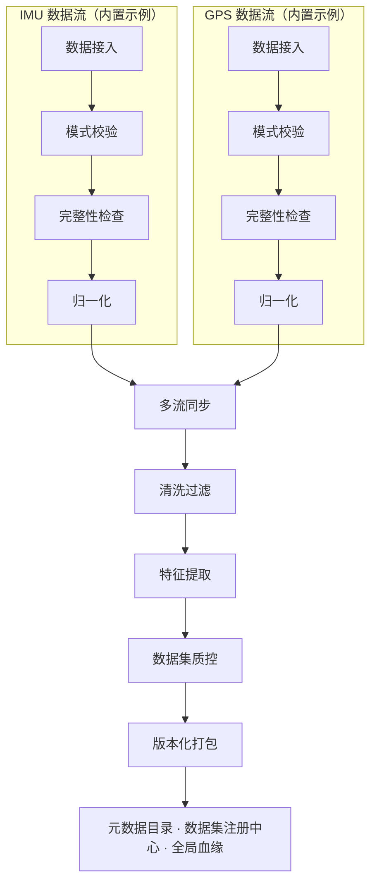

# Forge Data

**面向机器人与物理 AI 的可复现数据基础设施。**

**v1.0** · [English](README.md) · 中文 · [技术文档 / Technical Guide](docs/DETAILED_GUIDE.md)


<!-- 暂未提交仓库 banner 图片资源。 -->

Forge Data 将原始、异构的多模态传感器数据流转换为经过校验、时间对齐、质量控制、
防泄漏、血缘可追溯的机器学习数据集。它面向机器人与物理 AI 场景设计——IMU、GPS
等时钟独立的数据流必须经过确定性、可审计的预处理才能用于训练，而且数月之后
仍然要能回答"这份数据集到底是从哪来的？"

## Forge Data v1.0

v1.0 是本地核心流水线的首个完整版本——一条从原始上传到带版本号、血缘可追溯
数据集的连贯链路：

```
数据接入 → 模式校验 → 完整性检查 → 归一化 → 多流同步
   → 清洗过滤 → 特征提取 → 数据集质控 → 版本化打包
   → 全局血缘与数据集注册中心
```

链路中的每个阶段都已实现、测试并端到端接通——具体保证了什么、哪些刻意未覆盖，
见下方[状态](#状态)。

## 为什么做这个

机器人与多模态传感器数据存在一系列通用 ML 数据工具难以解决的问题：

- **格式异构、单位不统一** —— 一个文件用 `g`，另一个用 `m/s²`，第三个干脆没记录单位。
- **时钟相互独立** —— IMU 与 GPS 数据流会相对漂移，需要显式的时间对齐，而不是简单拼接。
- **模态缺失与质量问题** —— 某个传感器在采集过程中掉线；一批坏数据不该悄悄污染整个数据集。
- **窗口重叠与数据泄漏** —— 共享源数据行的特征窗口绝不能被拆分到训练集和测试集两侧。
- **可复现性与血缘** —— "是哪些原始文件、哪个配置、哪个代码版本产出了这份数据包？"需要一个真实答案，而不是猜测。

Forge Data 的应对方式：

- **产物一律不可变** —— 每个阶段只写一次；输入变化只会产生新产物，绝不原地修改。
- **处处 SHA-256 血缘** —— 每个产物与清单都带校验和，每个阶段都显式记录其上游父节点。
- **确定性转换** —— 归一化、窗口切分、数据集切分均由配置与种子驱动，绝非偶然结果。
- **阶段边界清晰** —— 模式校验、完整性检查、归一化、同步、清洗、质控是彼此独立、可单独测试的服务。
- **防泄漏的数据集打包** —— 在做出任何切分决策之前，先按源数据重叠关系对样本分组。
- **可重建的元数据目录** —— SQLite 只是对流水线自身清单建立的索引，绝非第二个真相来源。

## 流水线概览



IMU 与 GPS 是当前仓库内置的模式与归一化配置示例；数据接入 → 模式校验 → 完整性检查
→ 归一化这条链路、多流同步的对齐能力，以及元数据目录的血缘图，都与具体模式无关，
设计上支持在不改动前序阶段的情况下接入更多传感器类型。

## 核心能力

| 阶段 | 职责 | 关键保证 / 产出 |
|---|---|---|
| **数据接入** | 不可变原始上传 | 流式 SHA-256 校验，写一次存储，每次上传一份清单 |
| **模式校验** | 逐条记录的模式一致性 | 结构化错误/警告报告；内置 IMU、GPS 模式 |
| **完整性检查** | 语义/范围/一致性检查 | 超越模式形状本身——极值、顺序、按模式定制的检查器 |
| **归一化** | 统一单位与 UTC 时间戳 | 确定性衍生产物；按模式可插拔的归一化配置 |
| **多流同步** | 跨流时间对齐 | 最近邻 / 线性插值对齐，可配置容差，显式时钟校正 |
| **清洗过滤** | 过滤与脱敏 | 确定性丢弃/脱敏策略，覆盖率与去重规则 |
| **特征提取** | 特征工程 | 确定性计数/时间窗口切分，手工统计与衍生特征 |
| **数据集质控** | 数据集级质量控制 | 模态覆盖率、特征完整性、方差、漂移检查 |
| **版本化打包** | 训练/验证/测试集生成 | 按组防泄漏的确定性切分；JSONL（可选 Parquet）导出 |
| **元数据目录** | 全局血缘与数据集注册中心 | 可从文件系统清单重建的 SQLite 索引；带不可变语义化版本的数据集注册中心 |

## 数据流示例

```
输入：             imu.csv, gps.csv

流水线：           上传 → 校验 → 完整性检查 → 归一化 → 同步
                   → 清洗 → 特征提取 → 质控 → 打包

输出：             train.jsonl
                   validation.jsonl
                   test.jsonl
                   split_index.jsonl
                   manifest.json          （每个阶段都有一份）
                   + 记录在元数据目录中的血缘，可追溯回 imu.csv / gps.csv
```

完整的逐条 curl 演示见[完整技术文档](docs/DETAILED_GUIDE.md#end-to-end-demo)。

## 设计保证

**产物不可变** —— 各阶段从不改写上游产物。原始上传、校验报告、归一化产物、数据包——
一旦写入，就不会被后续阶段编辑或覆盖。

**确定性执行** —— 归一化、窗口切分、数据集切分均由显式配置和种子驱动，而非偶然的运行时状态。
两次独立运行，只要输入字节和配置相同，就会产出相同的衍生产物和相同的可复现性指纹。

**显式血缘** —— 每个产物都携带其上游父节点的 ID 和 SHA-256。元数据目录把这些信息
组织成显式的父子有向无环图，而不是隐含的顺序假设。

**关注点分离** —— 模式校验、完整性检查、归一化、同步、清洗、质控是刻意独立的服务，
各自拥有独立的存储目录和测试套件，而不是一个大任务里的若干阶段。

**防泄漏打包** —— 特征提取阶段产生的重叠窗口，会在打包阶段做出任何训练/验证/测试
切分决策之前，先按源数据行重叠关系分组，因此重叠样本组永远不会被拆到不同的切分中。

**可重建的元数据目录** —— SQLite 目录只是索引，不是真相来源。删除它之后，可以完全
从各阶段本就会写入的文件系统清单重新构建。

## 快速开始

```bash
git clone https://github.com/uudam42/forge-data.git
cd forge-data
python3 -m venv .venv && source .venv/bin/activate
pip install -e ".[dev]"

uvicorn app.main:app --reload
pytest
```

交互式 API 文档（Swagger UI）运行在 **http://localhost:8000/docs**——所有接口都可以
直接在浏览器中查看和调用，不需要写一行 curl 命令。

最小示例——上传一个原始文件：

```bash
curl -X POST http://localhost:8000/api/v1/ingestion/upload \
  -F "file=@imu.csv" -F "customer_id=demo" -F "device_id=imu_001"
# -> { "ingestion_id": "ing_...", "status": "stored", "sha256": "...", ... }
```

完整的 10 阶段 curl 演示见[完整技术文档](docs/DETAILED_GUIDE.md)。

## API 一览

| 分组 | 前缀 | 用途 |
|---|---|---|
| 数据接入 | `/api/v1/ingestion` | 原始上传，不可变存储 |
| 模式校验 | `/api/v1/validation` | 逐条记录的模式校验 |
| 完整性检查 | `/api/v1/integrity` | 语义/范围/一致性检查 |
| 归一化 | `/api/v1/normalization` | 统一单位与时间戳 |
| 多流同步 | `/api/v1/synchronization` | 跨流时间对齐 |
| 清洗过滤 | `/api/v1/cleaning` | 过滤、去重、脱敏 |
| 特征提取 | `/api/v1/transformation` | 窗口切分与特征工程 |
| 数据集质控 | `/api/v1/qc` | 数据集级质量控制 |
| 版本化打包 | `/api/v1/packaging` | 训练/验证/测试集打包与导出 |
| 元数据目录 | `/api/v1/catalog` | 扫描、重建、健康检查、产物查询、验证 |
| 血缘 | `/api/v1/lineage` | 上下游遍历、影响分析 |
| 数据集 | `/api/v1/datasets` | 数据集注册中心、版本、可复现性 |

完整接口参考、请求/响应结构与错误码：[完整技术文档](docs/DETAILED_GUIDE.md)。

## 产物目录结构

```
data/
  raw/            不可变的原始上传 + 清单
  validation/     模式校验报告
  integrity/      完整性检查报告
  normalized/     统一单位后的产物
  synchronized/   时间对齐后的多流产物
  cleaned/        过滤/脱敏后的产物
  transformed/    窗口特征产物
  qc/             数据集质控报告
  packages/       版本化的训练/验证/测试数据包
  catalog/        SQLite 元数据目录（catalog.db）
```

以上每个目录的运行时内容都被 Git 忽略，只保留 `.gitkeep` 占位——`data/` 由运行流水线
重新生成，从不提交到版本库。

## 数据集版本与血缘

一个数据集版本是指向唯一一个数据包的不可变指针，其完整上游链路可以从元数据目录
重建出来：

```
robotics_demo @ 1.0.0
      └─ 数据包 package
            ├─ 特征提取 transformation
            │     └─ 清洗 cleaning
            │           └─ 同步 synchronization
            │                 ├─ IMU 归一化
            │                 └─ GPS 归一化
            │                       └─ 原始接入
            └─ 质控报告 QC report
```

- 尝试把一个版本重新指向另一个数据包会被直接拒绝（`409 DATASET_VERSION_IMMUTABLE`）——
  版本是永久指针。
- `POST /api/v1/catalog/verify/{type}/{id}?recursive=true` 一次调用即可重新计算某个产物
  及其全部上游血缘的校验和。
- `GET /api/v1/datasets/{name}/versions/{version}/reproducibility` 返回数据包背后的全部
  内容与配置哈希，以及一个**血缘指纹**——对这组哈希值计算的 SHA-256，排除执行 ID 与
  时间戳，因此两次针对等价数据与配置的独立运行会产出完全相同的指纹。
- `GET /api/v1/lineage/{type}/{id}/impact` 报告下游影响——如果某个上游产物出了问题，
  会影响哪些下游产物、哪些数据集版本。

## 测试

878 个测试目前覆盖了各阶段行为、血缘校验门禁、确定性、产物不可变性、校验和验证、
API 契约，以及完整的端到端流水线运行。

```bash
pytest
```

## 项目结构

```
app/
  ingestion/ validation/ integrity/ normalization/   各阶段服务
  synchronization/ cleaning/ transformation/
  qc/ packaging/
  catalog/            血缘图、验证、数据集注册中心、SQLite 目录
  storage/            各阶段的不可变产物存储 + 元数据目录存储
  api/routes/         FastAPI 路由，每个阶段一个
tests/                878 个测试
schemas/              内置的 IMU / GPS 模式定义
docs/DETAILED_GUIDE.md   完整的架构、API 与错误码参考
```

## 状态

**当前发布版本：Forge Data v1.0**

v1.0 核心流水线已完整实现并完成端到端验证，具备：

- 各阶段产物不可变
- 确定性转换
- 数据集级质控
- 防泄漏打包
- 全局血缘
- 数据集版本注册中心

当前实现是**本地优先、单节点**的。云存储、任务编排、鉴权、多租户与 Web 控制台
计划在下一阶段实现——见[路线图](#路线图)。

## 当前范围

**已实现：**
- 基于本地文件系统的完整流水线，端到端贯通（从数据接入到打包与元数据目录）
- IMU 与 GPS 作为内置的模式/归一化配置示例
- 带交互式 Swagger 文档的 FastAPI HTTP 接口
- 确定性处理、数据集质控、防泄漏打包
- 基于 SQLite 的元数据目录，可从文件系统清单重建

**刻意尚未实现：**
- 云对象存储后端（S3 / GCS / Azure Blob）
- 鉴权、授权或多租户
- 分布式或编排式执行
- Web 控制台
- 传感器模式自动推断
- 生产级（非 SQLite）数据库部署

## 路线图

现实的下一步方向，不代表承诺或具体时间：

- 可插拔的云存储后端
- 流水线任务编排与运行历史
- 鉴权与工作空间隔离
- 面向元数据目录与血缘图的 Web 控制台
- 更丰富的机器人数据连接器（例如 ROS bag 接入）
- 生产级可观测性（指标、结构化追踪）

## 文档

- [完整技术文档](docs/DETAILED_GUIDE.md) —— 架构、全部 API 与错误码、各阶段设计说明、MVP 限制
- [English README](README.md)

## 贡献

本项目目前还没有正式的贡献流程——如果你有兴趣贡献代码，欢迎先开一个 issue 讨论，
再提交 pull request。
